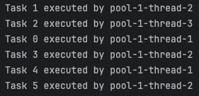

# 🧵 스레드 풀(Thread Pool)

📅 작성일: 2025-04-07  
📂 분류: OS / Multithreading  
🔖 태그: #ThreadPool #멀티스레딩 #자바 #ExecutorService #톰캣 #성능최적화

---

## 🔍 요약

스레드 풀(Thread Pool)은 스레드를 **매번 새로 만들지 않고**

**미리 생성해둔 스레드를 재사용**하면서

많은 작업을 **효율적이고 안정적으로 처리하는 구조**이다.

Spring Boot의 내장 톰캣 서버나 자바의 `ExecutorService` 등에서 실무적으로 자주 사용

---

## ✅ 왜 필요한가?

- 스레드를 매번 생성 / 제거하면 성능 저하 및 자원 낭비 발생
- 요청이 많아질수록 스레드를 무제한 생성하면 OutOfMemory 위험
- 스레드 풀은 **성능 향상 + 자원 보호 + 안정성**을 모두 확보할 수 있음

---

## 🧠 핵심 개념

| 항목 | 설명 |
|----|------|
| 풀(Pool) | 미리 생성된 스레드를 저장하는 공간 |
| 재사용 | 작업이 끝난 스레드를 다시 재사용 |
| 제한 | 최대 스레드 수를 제한하여 과도한 생성 방지 |
| 큐 | 스레드가 바쁘면 요청을 대기 큐에 넣음 |

---

## ✅ 코드 예시

```java
ExecutorService executor = Executors.newFixedThreadPool(3);

for (int i = 0; i < 6; i++) {
    final int taskId = i;
    executor.submit(() -> {
        System.out.println("Task " + taskId + " executed by " + Thread.currentThread().getName());
    });
}

excutor.shutdown();
```



- 3개의 스레드로 6개의 작업을 처리
- 3개는 즉시 실행, 나머지 3개는 큐에서 대기 후 실행됨

---

## ✅ 비동기에서 스레드 풀은?

### @Async

- 요청과는 별도로 백그라운드에서 실행되는 비동기 작업

```java
@Async
public void sendEmail() {...}
```

- `@EnableAsync` 사용 시, 내부적으로 기본 `SimpleAsyncTaskExecutor` 사용

-> 이건 스레드 풀이 아니라 **요청마다 새로운 스레드를 생성함**
-> 성능 저하 및 자원 고갈 위험이 있음

📌 그래서 실무에선 반드시 ThreadPoolTaskExecutor 설정을 커스터마이징해야함

```java
@Configuration
@EnableAsync
public class AsyncConfig {
    @Bean
    public Executor taskExecutor() {
        ThreadPoolTaskExecutor executor = new ThreadPoolTaskExecutor();

        executor.setCorePoolSize(10);  // 기본적으로 유지할 스레드 수
        executor.setMaxPoolSize(20);  // 최대로 확장 가능한 스레드 수
        executor.setQueueCapacity(100); // 작업 요청이 몰렸을때, 스레드가 처리 못하면 일단 저장해두는 작업 대기열(큐) 용량
        executor.setThreadNamePrefix("Async-");  // 스레드 이름 앞에 붙는 prefix 설정(디버깅/로그용)
        executor.initialize();  // 설정을 적용하고 스레드 풀 초기화
        return executor;
    }
}
```